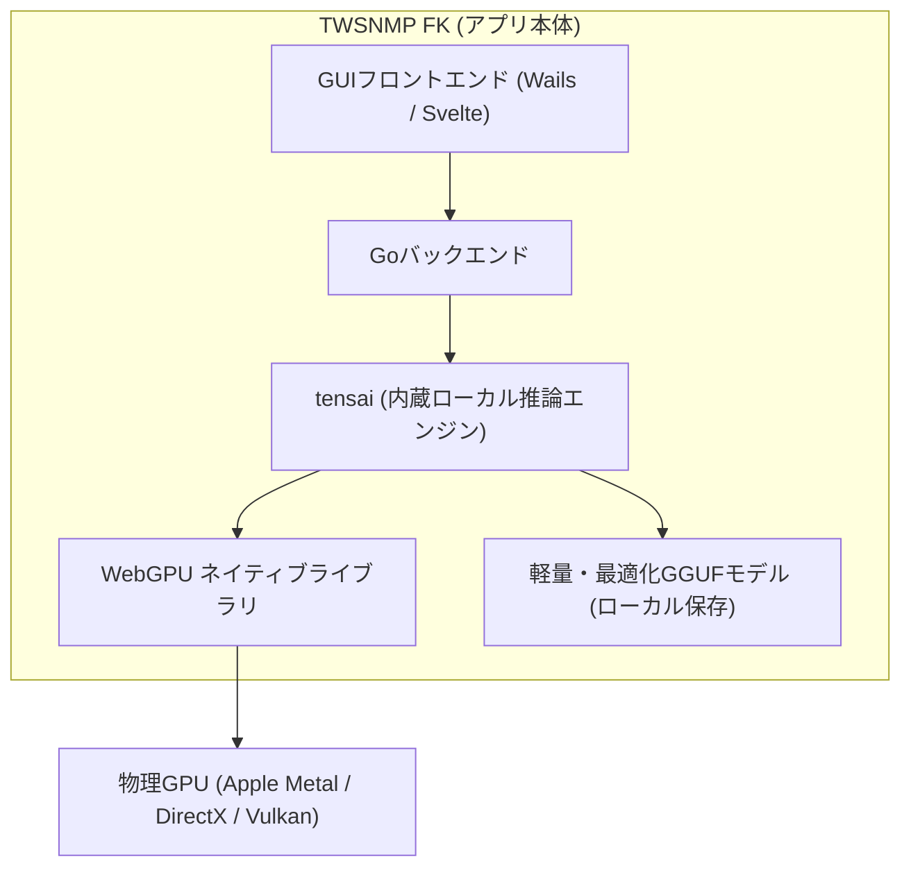

# はじめに

オープンソースのデスクトップ型ネットワーク統合監視ツール **[TWSNMP FK](https://github.com/twsnmp/twsnmpfk)** が、最新の **v2.4.0** において大きな進化を遂げました。

なんと、**AI（ローカルLLM）推論エンジンがアプリ本体に完全内蔵** されました！

これまで TWSNMP FK でも OpenAI / Gemini / Claude などのクラウドAPI連携や、Ollama を使ったローカルLLM連携に対応していましたが、今回のアップデートにより **外部サーバーの起動もクラウドAPIの契約も一切不要** となり、アプリ単体でダウンロードしたその日から安全なローカルAIアシスタント機能を利用できるようになりました。

本記事では、この「内蔵AI」がなぜネットワーク監視において画期的なのか、その仕組みと具体的な活用シーン、そしてセットアップ手順をご紹介します。

:::message
**【コラム：従来の「AI分析」は「異常検知」へ用語変更】**
TWSNMP FK v2.4.0 では、本記事で紹介する**LLM（対話型生成AI）**と、機械学習（Isolation ForestやAutoencoder等）でメトリック数値の外れ値を検出する**「異常検知（Anomaly）」**の役割分担を明確にするため、従来の「AI分析」メニューや設定項目が「**異常検知**」へと表記統一されました。
:::

---

# なぜ「AIの内蔵」が必要だったのか？

近年の生成AIの急速な発展に伴い、「難解なSyslogメッセージをAIに解説してもらう」「ネットワーク障害の兆候をAIに総合診断してもらう」といったAIアシスタントの需要は高まっています。

しかし、ネットワーク監視の実務においてAIを活用するには、これまで2つの大きな壁がありました。

### 1. クラウドAIのセキュリティ・プライバシーの壁
社内LANのプライベートIPアドレス、ホスト名、ネットワーク機器のトポロジー、Syslogに含まれるユーザー認証ログや内部通信ログなどを **「外部クラウドに送信できない」「セキュリティポリシー上NG」** という企業・現場は非常に多いのが実情です。

### 2. ローカルLLM（Ollama等）の環境構築の壁
外部にデータを送らない解決策として Ollama などのローカルLLMサーバーを別途立ち上げる方法がありましたが、
* 別途ツールのインストールや常駐プロセスの管理が必要
* コマンドラインでのモデル起動やポート設定、接続先URLの設定が必要
* 監視PCを再起動した際にAIサーバーが立ち上がっていなくてエラーになる

など、一般のネットワーク管理者や現場担当者にとって導入の敷居がやや高いという課題がありました。

---

# TWSNMP FK v2.4.0 の内蔵AIアーキテクチャ

v2.4.0 ではこれらの課題をすべて解決するため、**「ゼロコンフィグ」「完全オフライン」「GPU高速化」** を備えた内蔵AIエンジンが統合されました。

### tensai パッケージによるローカル推論
Go言語環境で直接動作する軽量な推論パッケージ `tensai` を組み込むことで、外部プロセスやPythonランタイムなどを一切介さずに、TWSNMP FK のバイナリ内部でダイレクトにモデルを実行します。

### WebGPU によるハードウェアアクセラレーション
CPUだけの推論では応答に時間がかかりがちですが、TWSNMP FK は **WebGPU** ネイティブライブラリを自動配備・活用します。
macOS（Apple Silicon Metal）や Windows（DirectX 12 / Vulkan）などのGPUを活用することで、ローカル環境でもストレスのない高速な応答速度を実現しています。

### GGUFモデルの簡単管理
設定画面の「ローカルモデル管理」から、実用的で日本語にも強い推奨GGUFモデルをワンクリックでダウンロード・選択できます。

*▲ 設定画面から開けるローカルモデル管理ダイアログ。モデルの取得から切り替えまでGUI完結*

---

# 内蔵AIが活躍する監視・運用シーン

TWSNMP FK のAIは、汎用的なチャットボットではありません。**ネットワーク監視ツールの各機能と深く連携した実務直結のAIアシスタント** です。

---

## 1. ノードAI総合診断
マップ上の機器を右クリックして「AI診断」を実行するだけで、
* 対象ノードの基本スペック（IP、MAC、ベンダー、SNMP情報）
* 設定されているポーリング（Ping、SNMP、HTTP等）の直近の稼働・障害状態
* 直近24時間に発生したSyslog、SNMP Trap、EventLog、ARPログなどの関連イベント

を一元的に入力し、現在のノード状態の推定原因、他ノードへの波及リスク、管理者が確認すべき対処手順を日本語でわかりやすく出力します。

*▲ ノードの詳細情報と直近ログから総合的なアドバイスを出力*

---

## 2. Syslog Sigma検知の脅威分析と対策アドバイス (v2.4.0新機能)
v2.4.0 で追加された「Sigma検知」では、75種類のオープンなSigmaルールに基づき、Syslogからサイバー攻撃や不正アクセス、不審な兆候を自動検知します。

検知されたログに対してAI解説を実行すると、
* **攻撃手法の解説**: どのような脆弱性や手口（Brute Force、特権昇格、不正ログイン試行など）が狙われたか
* **危険度と影響範囲の評価**: 侵害の拡大リスク
* **緊急初動対応**: ファイアウォールでのIP遮断、アカウント停止、ログ保全などの推奨アクション

を具体的に助言してくれます。

*▲ Sigma検知された脅威ログをAIが即座に分析・解説*

---

## 3. 自動発見時のノード種別AI推測 & センサー自動マッピング (v2.4.0新機能)
新しいネットワークセグメントを探索する「自動発見」機能でもAIが活躍します。
応答のあったホスト名、SysObjectID、開放ポート、MACベンダー情報などから、AIが機器の種別（ルーター、L2/L3スイッチ、サーバー、NAS、プリンター等）を自動推測。最適なアイコンと監視項目（センサー）を自動で割り振ってくれます。

*▲ v2.4.0の自動発見画面。AI判定やライン自動接続オプションを搭載*

---

## 4. トポロジー探索（接続先を探す）のAI推測 (v2.4.0新機能)
機器同士が物理的・論理的にどこに繋がっているのかを探索する「接続先を探す」画面では、LLDPやCDP、FDB（MACアドレステーブル）、ARPテーブルなどの情報から候補ラインを算出します。
情報が断片的な場合でも、AIがサブネットやポート構成から接続先を推測し、確信度（高・中・推測）とともに提示してくれます。

*▲ 判定理由や確信度とともに接続候補を表示。AIによる推測にも対応*

---

## 5. Syslogからのポーリング自動作成アシスト
Syslogログ一覧で気になるログを選択し、`[AIアシスト]` を押すと、そのログを監視するための「正規表現フィルター」と「判定スクリプト」をAIが自動生成します。

毎回変わるプロセスID（PID）やポート番号、送信元IPなどの可変部分を自動で正規表現に抽象化し、TWSNMP FK の判定ルール（「正常時 `true` または `count == 0`」）に合わせたJavaScript式を組み立ててくれるため、正規表現やスクリプトが苦手な方でもミスなく監視ルールを組むことができます。

*▲ 受信ログから監視用正規表現と評価式をワンタッチで自動生成*

---

## 6. 自然言語によるポーリング作成 & PING/MTR品質解説
* **自然言語アシスト**: 「Ping応答が100msを超えたらアラート」「Webサーバーのレスポンスが200以外なら異常」と日本語で入力するだけで、監視種別の選定からナノ秒単位への自動換算まで行います。
* **PING / MTR 解説**: レイテンシ、ジッター、パケットロス率、MTRの経路統計から、「どのホップで遅延が跳ね上がっているか」「社内LANかプロバイダ境界か」を切り分けた解説を提示します。

---

# わずか3ステップ！内蔵AIの使い方

内蔵AIを利用する手順は非常にシンプルです。

### ステップ1: 設定画面を開く
TWSNMP FK の画面右上の歯車アイコン（システム設定）をクリックし、LLM設定の項目にある **「ローカルモデル管理」** ボタンをクリックします。

### ステップ2: モデルをダウンロード
一覧に表示される推奨GGUFモデルの横にある **「ダウンロード」** ボタンをクリックします。
ダウンロードが完了すると、自動的にWebGPUライブラリとともに内蔵推論エンジンがスタンバイ状態になります。

### ステップ3: いつもの画面でAIボタンを押すだけ
設定が有効になると、マップやノード詳細、各種レポート画面の右下に `[AI診断]` `[AI解説]` `[AIアシスト]` ボタンが出現します。
クリックすれば、PC内部のGPUを使って数秒〜十数秒で丁寧な日本語アドバイスが返ってきます。

:::message alert
**外部通信は一切発生しません**
モデルの初回ダウンロード時のみ配布元リポジトリへのインターネット接続が必要ですが、モデル取得後は完全なオフライン環境でもすべてのAI機能が動作します。ログや設定データが外部サーバーへ送信されることは一切ありません。
:::

---

# 従来の外部LLMとの使い分け

内蔵AIの搭載後も、従来の外部プロバイダー設定（OpenAI, Gemini, Claude, Ollama）は引き続きそのまま利用できます。

| プロバイダー | メリット | 推奨利用シーン |
| --- | --- | --- |
| **内蔵ローカルLLM (tensai)** | **外部サーバー不要、完全オフライン、データ漏洩リスクゼロ、通信費ゼロ** | **日常の監視・診断全般、機密ネットワーク、スタンドアロンPC環境** |
| **外部Ollama** | 独自ファインチューニングモデルや大容量モデル（32B〜70B等）の利用が可能 | 高性能な別サーバーマシンがある環境 |
| **クラウドAPI (Gemini/OpenAI等)** | 最高峰の推論能力と長文理解力 | 厳密な情報漏洩規制のない環境での高度なトラブルシューティング |

用途やセキュリティ要件に合わせて、設定画面からいつでも自由に切り替えが可能です。

---

# まとめ

TWSNMP FK v2.4.0 の内蔵AI機能により、ネットワーク監視におけるAI活用の敷居が一気に下がりました。

* **完全内蔵**: Ollama等の別サーバー不要。アプリ単体で完結
* **WebGPU高速化**: PCのGPUを活用した高速ローカル推論
* **強固なセキュリティ**: 外部送信ゼロ・完全オフライン対応
* **実務直結の支援**: ノード診断、Syslogポーリング自動化、Sigma脅威分析、トポロジー推測まで網羅

「社内ネットワークのデータを外部に出せない」「でもAIの力を借りて運用の手間を減らしたい」という管理者の方にとって、まさに理想的なソリューションです。

ぜひ最新の TWSNMP FK v2.4.0 をダウンロードして、完全ローカルで動くネットワーク監視AIの快適さを体験してみてください！

---

### 関連リンク
* **TWSNMP FK GitHub**: [https://github.com/twsnmp/twsnmpfk](https://github.com/twsnmp/twsnmpfk)
* **公式マニュアル (Zenn Book)**: [https://zenn.dev/twsnmp/books/twsnmpfk-manual](https://zenn.dev/twsnmp/books/twsnmpfk-manual)
* **TWSNMP 公式ドキュメント**: [https://twsnmp.github.io/twsnmpfk/index_ja.html](https://twsnmp.github.io/twsnmpfk/index_ja.html)
